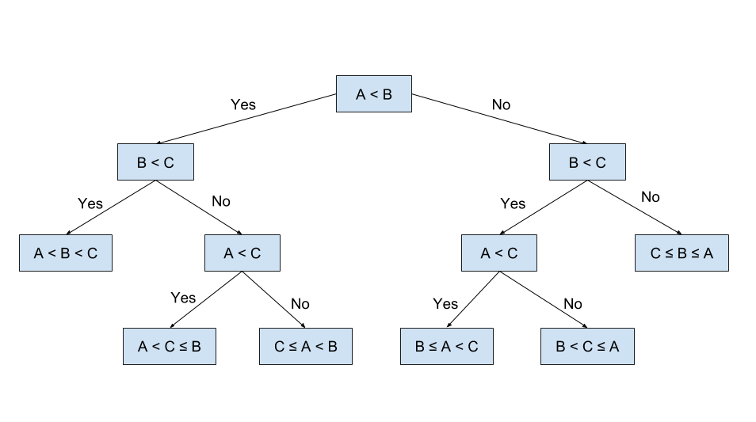

비교 정렬 알고리즘의 하한 그리고 의사결정나무에 대하여,

## 비교 정렬 알고리즘의 하한

정렬에는 여러가지 종류가 있다.

- 삽입 정렬
- 선택 정렬
- 버블 정렬
- 병합 정렬
- 퀵 정렬

이러한 정렬들은 단순 데이터의 크기를 비교하여, 
수행하게 되는데, 이러한 정렬 방식을 **Comparison sort**라고 한다.

이러한 정렬 방식의 수행 시간 T에 대하여 **T >= nlogn** 이라는 한계를 가지고 있는데,
> 아무리 빨리 해도, nlogn 보다 빠르게 수행될 수 는 없다는 뜻 이다.

왜 그렇게 되는것인지 알아보도록 하자.

## 의사 결정 나무 (Decision Tree)

> 의사 결정 나무의 그림이다.

비교를 하여 정렬하는 알고리즘은 추상적인 관점에서,
모두다 결정 트리의 결과물로 볼 수가 있다.

이러한 결정트리는 주어진 입력에 대해, 특정 알고리즘이 수행하는 **원소의 비교**를 표현하는
Full Binary Tree가 된다.

위 의사 결정트리의 그림을 보면, 
ABC 세 개의 원소사이의 비교를 통하여, 
가능한 모든 순서를 Leaf 노드에 나열해 놓았다
